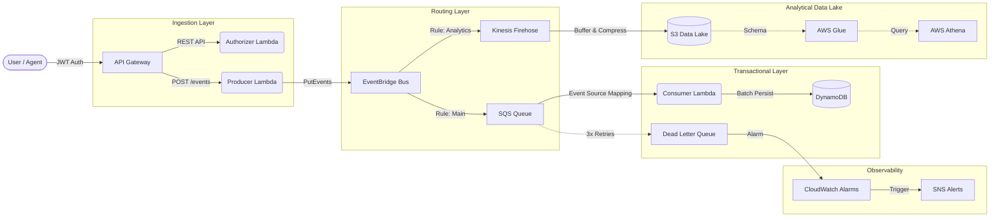

# 🧠 Cortex — Serverless Data Pipeline


> A modern, production-grade, and **100% Zero-Cost** Serverless Data Pipeline for Infrastructure Monitoring. Built with a focus on **Resilience**, **Observability**, **Data Lakehouse analytics**, and **Infrastructure as Code**.

---

## 🏛️ Architecture

The Cortex pipeline is designed to ingest high-throughput telemetry, process it securely, and fan out the data to both a real-time transactional database and a historical analytical Data Lake.



## 📌 Development Status

| Component | Status |
|---|---|
| **Pipeline Core** | ✅ API Gateway → EventBridge → SQS → Consumer → DynamoDB |
| **Data Lake** | ✅ Kinesis Firehose → S3 Data Lake → Glue → Athena |
| **Observability** | ✅ Powertools Logging, X-Ray Tracing, CloudWatch Alarms & SNS |
| **CI/CD** | ✅ GitHub Actions (Lint, Mypy, Bandit, Pytest, Terraform, Semantic Release) |
| **Local Environment** | ✅ 100% Free LocalStack 3.8.1 emulation with Zero-Cost bypass |

## ⚡ Technology Stack

| Layer | Technology |
|---|---|
| **Ingestion** | AWS API Gateway (REST API v1) + Custom JWT Authorizer |
| **Validation** | AWS Lambda (Python 3.12) + Pydantic |
| **Messaging** | AWS EventBridge + AWS SQS + Dead Letter Queue |
| **Processing** | AWS Lambda (Consumer) |
| **Persistence** | AWS DynamoDB (On-Demand, Idempotent) |
| **Data Lake** | Amazon S3 + Kinesis Firehose + AWS Glue + AWS Athena |
| **Observability**| AWS Lambda Powertools + AWS X-Ray + CloudWatch + SNS |
| **IaC** | Terraform (HCL) |
| **Dev Environment**| LocalStack 3.8.1 + Docker Compose |

## 🔬 Engineering Highlights

<details>
<summary><strong>Advanced Architectural Decisions & Trade-offs</strong></summary>

### 1. The Zero-Cost Local Environment Bypass
To guarantee a completely free development environment, this project enforces an infrastructure lockdown against LocalStack Pro features. Terraform dynamically utilizes `count = var.use_localstack ? 0 : 1` to gracefully skip Pro services (Glue and Athena) during CI/CD LocalStack emulation, while successfully deploying them when targeting the real AWS cloud. We specifically pinned LocalStack to `v3.8.1` to bypass mandatory cloud account authentications introduced in v4.

### 2. Idempotency & Partial Batch Failure
The Consumer utilizes DynamoDB `ConditionExpression` (`attribute_not_exists`) to guarantee that messages reprocessed by SQS do not generate duplicate entries. This pairs seamlessly with SQS `ReportBatchItemFailures`, ensuring that only failing messages within a batch are retried, preventing successful messages from being needlessly reprocessed.

### 3. Event-Driven Fan-Out Pattern
Migrating from direct SQS invocation to Amazon EventBridge allows the pipeline to implement a robust fan-out architecture. A single telemetry event from the Producer is instantly routed to both the transactional pipeline (SQS -> DynamoDB) and the analytical pipeline (Firehose -> S3) without adding execution overhead to the Producer Lambda.

### 4. Lambda Package Optimization (27MB → 5.2MB)
`boto3` and `botocore` are pre-packaged in the standard AWS Lambda Python runtime. Removing them from the build packaging reduced the deployment artifact size from ~27MB to 5.2MB, significantly improving cold-start times and deployment speed.
</details>

---

## 📁 Repository Structure

```text
cortex/
├── src/
│   ├── producer/       # Lambda — validates & puts events to EventBridge
│   ├── consumer/       # Lambda — pulls from SQS & persists to DynamoDB
│   ├── authorizer/     # Lambda — JWT validation for API Gateway
│   ├── read_api/       # Lambda — FastAPI microservice for querying events
│   └── shared/         # Shared schemas, constants, logging utils
├── terraform/          # Complete Infrastructure as Code (EventBridge, S3, Glue, etc)
├── scripts/            # Deployment, load testing, and seeding utilities
├── tests/
│   ├── unit/           # Unit tests with fully mocked AWS resources (boto3 stubs)
│   └── integration/    # E2E Tests running against LocalStack
├── docker-compose.yml  # LocalStack container configuration
├── Makefile            # Automation targets (make deploy, make test)
└── pyproject.toml      # Dependency management and tool config
```

## 🚀 Quick Start

### Prerequisites
- Python 3.12+
- Docker & Docker Compose
- Terraform >= 1.5

### 1. Install Dependencies
```bash
pip install -e ".[dev]"
```

### 2. Deploy Locally (LocalStack)
```bash
make localstack-up      # Starts the LocalStack container (v3.8.1)
make deploy-local       # Packages Lambdas and runs terraform apply locally
```

### 3. Run Tests
```bash
make test               # Runs unit tests
make test-integration   # Runs E2E integration tests against LocalStack
```

### 4. Test the Pipeline
```bash
# Send a valid telemetry event
curl -X POST http://localhost:4566/restapis/<api-id>/dev/_user_request_/events \
  -H "Content-Type: application/json" \
  -H "Authorization: Bearer <your-jwt-token>" \
  -d '{
    "source": "server-web-01",
    "event_type": "cpu_usage",
    "severity": "warning",
    "data": {"cpu_percent": 87.5, "load_avg_1m": 2.3}
  }'
```

### 5. Load Testing
```bash
make load-test          # 10 requests
make load-test-100      # 100 requests
```

## 🛡️ Resilience & Security

| Feature | Implementation |
|---|---|
| **Dead Letter Queue (DLQ)** | Events failing >3 times are diverted to a DLQ for manual inspection. |
| **Alarms & Alerts** | CloudWatch Alarms monitor DLQ traffic and trigger SNS email alerts. |
| **Authorization** | REST API is secured with a Custom Lambda Authorizer expecting JWTs. |
| **Secret Management** | JWT Secrets and API Keys are securely injected via Terraform environment variables. |

## 📋 Useful Commands

```bash
make help             # List all targets
make lint             # Ruff check + format check
make typecheck        # Mypy type validation
make deploy           # Deploy to real AWS Account
make destroy-local    # Tear down LocalStack infra
make clean            # Remove build artifacts and caches
```

## 📄 License
Copyright 2026 Davi Laurindo

Licensed under the Apache License, Version 2.0. See [LICENSE](LICENSE) for details.
